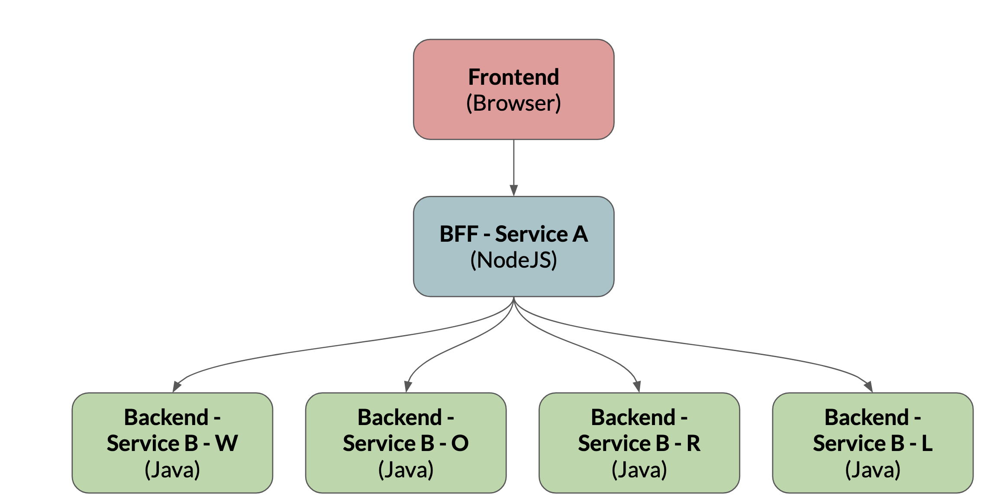
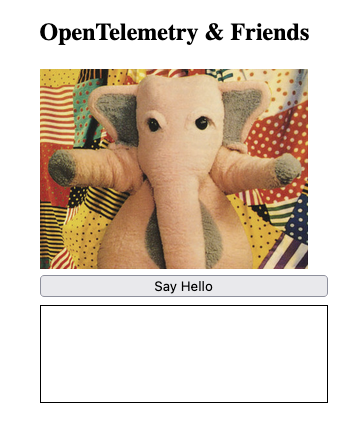

# OpenTelemetry & Friends

Multi-layer OpenTelemetry example demonstrating how trace data is generated from a frontend application, and then passed through multiple downstream services, deployed on AWS. The demo can output to XRay, and HoneyComb.io



## Prerequisites
NodeJS v16+ installed
AWS CLI configured and available.

## Install and Deploy
Install CDK dependencies
```
    cd cdk && npm install
```
CDK Deploy
```
    npm run cdk synth && npm run cdk deploy
```

By default, the application will only send traces to AWS Xray. To use Honeycomb as well, set the following environment variable to your [Honeycomb API](https://docs.honeycomb.io/working-with-your-data/settings/api-keys/)
key, which will then inject the API key into the various ECS containers.

:warning: Don't do it like this in a production settings, as the secret is exposed, but it's ok for a demo. Use [AWS Secrets Manager](https://aws.amazon.com/secrets-manager/)

```
export HONEYCOMB_API_KEY=XXXXX
```


## Sub-Folders
Folders are:
- `alfred_service_a`: NodeJS BFF application.
- `cdk`: AWS CDK component to deploy application to AWS
- `collector`: Custom OtelCollector configuration based on AWS Otel Distrubtion collector.
- `diesel_service_b`: Spring based Java microservice.
- `johnson_frontend`: Frontend JavaScript application.